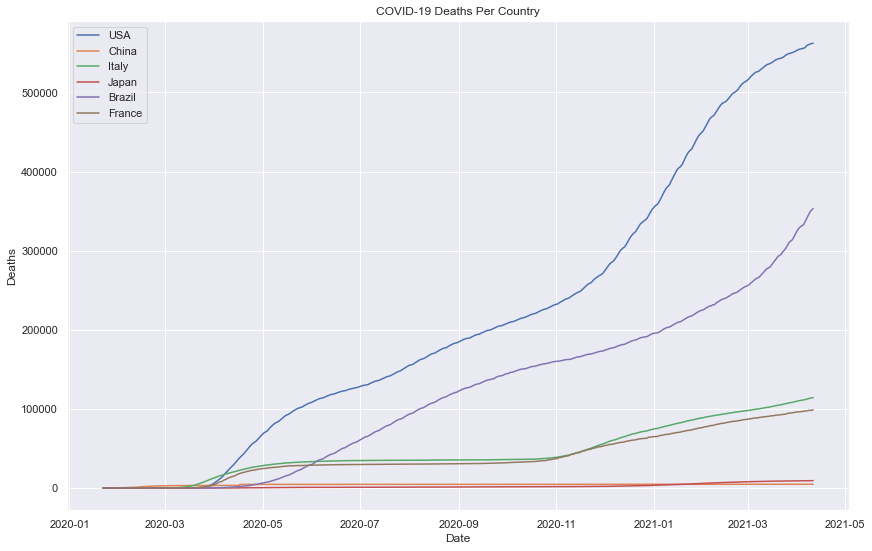
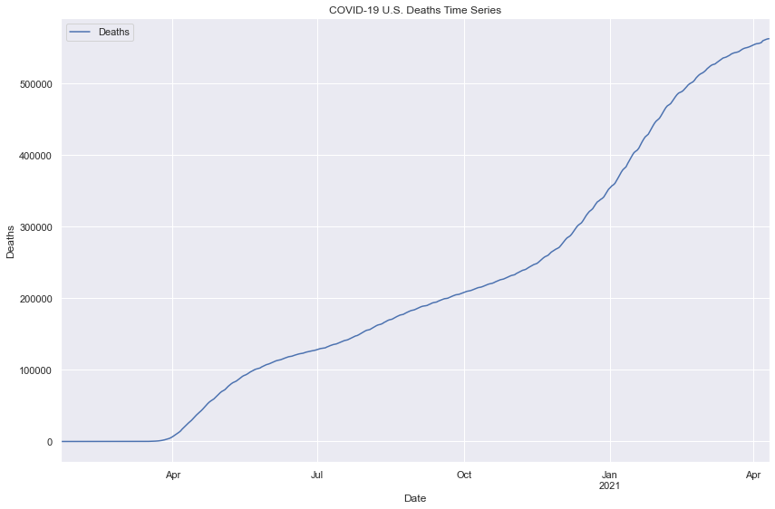
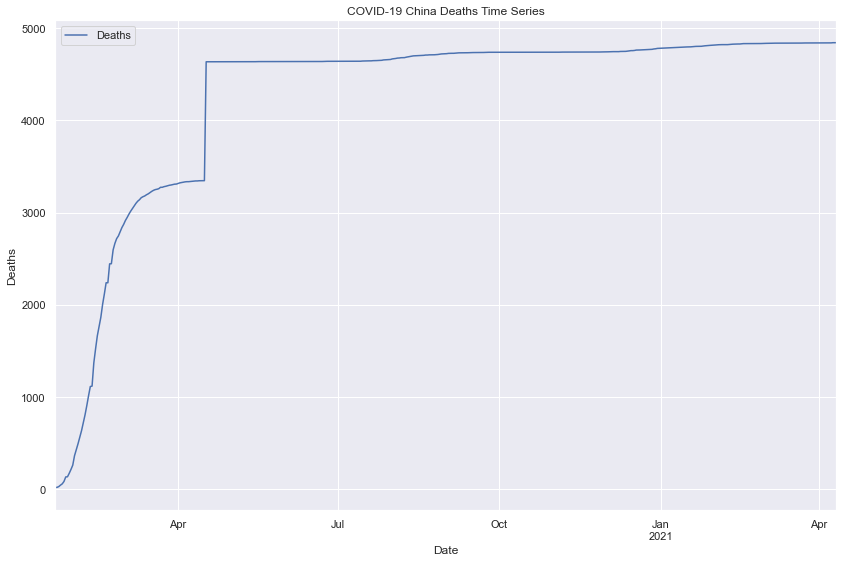
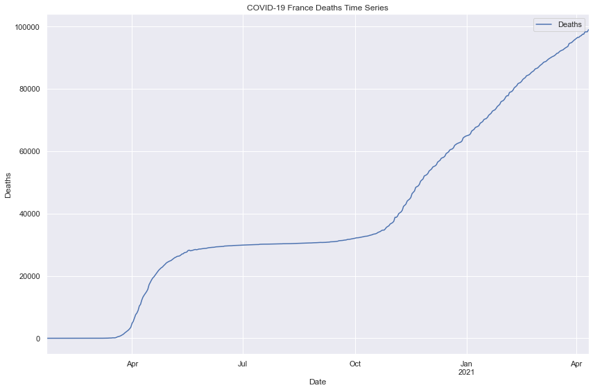
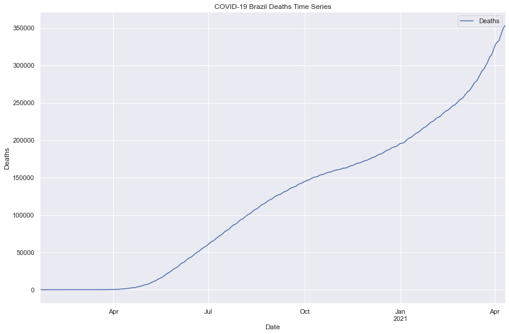
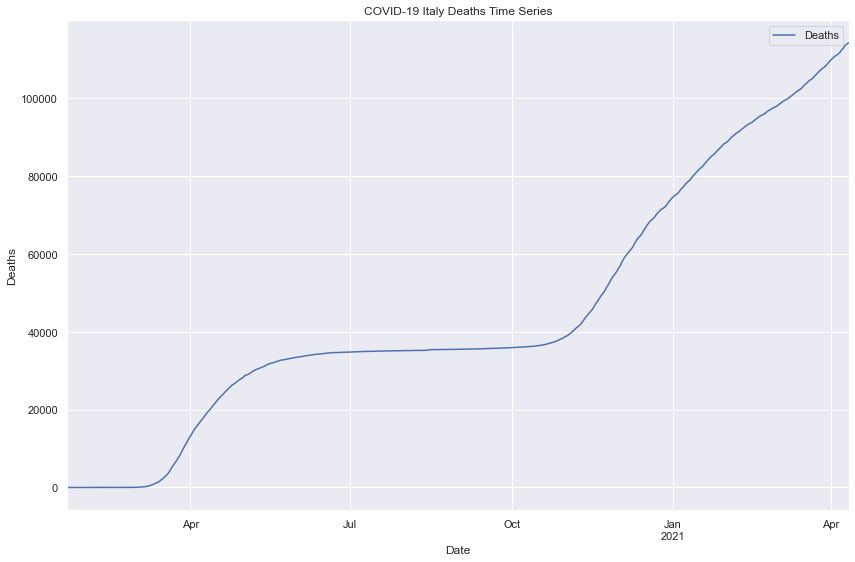
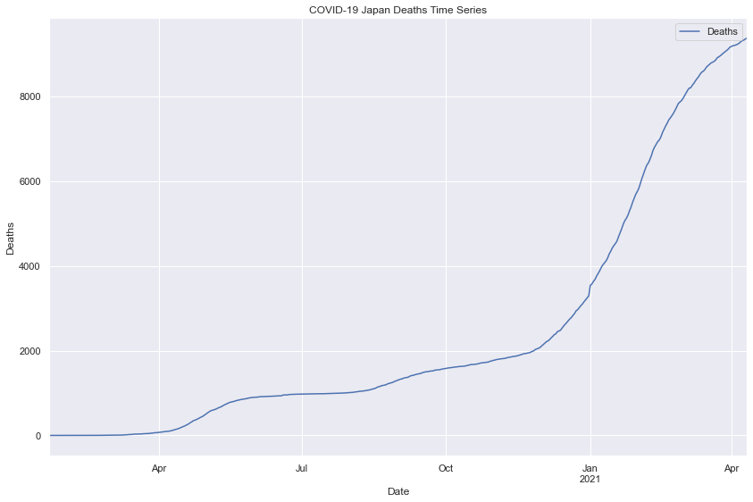

# JH-COVID-Global-TS
Gather time series data from JHU GitHub to create a time series

[JHU COVID-19 Time Series Data](https://github.com/CSSEGISandData/COVID-19/tree/master/csse_covid_19_data/csse_covid_19_time_series)

---

## Overview:
* `merge()` 3 .csv files into 1 data frame
* Data was given in wide format, I had to convert to long format using `melt()`
* Plotted data together and by individual coutry

## Global Deaths Time Series

## U.S.A Deaths Time Series

## China Deaths Time Series

## France Deaths Time Series

## Brazil Deaths Time Series

## Italy Deaths Time Series

## Japan Deaths Time Series

---

Future Updates: Add time series for confirmed cases and recovered, automate
